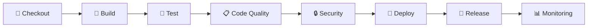

# 🚀 Jenkins CI/CD Pipeline - Quick Start Guide

## ✅ Status: Project Ready for Jenkins Pipeline!

Dự án **10.1P Butterfly Club** của bạn đã sẵn sàng để chạy Jenkins CI/CD pipeline với đầy đủ 8 stages chính:

---

## 🎯 Pipeline Overview

### 8 Stages Pipeline Architecture



### Stage Details

| Stage | Description | Duration | Key Actions |
|-------|-------------|----------|-------------|
| **🔄 Checkout** | Source code retrieval | ~30s | Git clone, branch detection, metadata |
| **🚀 Build** | Application build | ~2-3min | npm install, env setup, dependency audit |
| **🧪 Test** | Automated testing | ~3-5min | Unit tests, integration tests, performance |
| **📋 Code Quality** | Code analysis | ~2-4min | ESLint, complexity analysis, documentation |
| **🔒 Security** | Security scanning | ~3-7min | Vulnerability scan, secret detection, audit |
| **🚀 Deploy** | Deployment | ~2-3min | Staging deployment, smoke tests |
| **🎯 Release** | Production release | ~1-2min | Production approval, release packaging |
| **📊 Monitoring** | Monitoring setup | ~1-2min | Performance baseline, health checks, alerts |

**Total Pipeline Duration: ~15-25 minutes**

---

## 🚀 Quick Start Steps

### Step 1: Jenkins Server Setup
```bash
# Ensure Jenkins is running on localhost:8080
# Access: http://localhost:8080
```

### Step 2: Configure Jenkins Credentials
```bash
# Navigate to: Manage Jenkins → Manage Credentials → Global credentials
# Add the following credentials:

ID: github-token
Type: Secret text
Secret: [Your GitHub Personal Access Token]

ID: snyk-token  
Type: Secret text
Secret: [Your Snyk API Token - Get from https://snyk.io/]

ID: jwt-secret
Type: Secret text
Secret: $(openssl rand -base64 32)

ID: session-secret
Type: Secret text  
Secret: $(openssl rand -base64 32)

ID: encryption-key
Type: Secret text
Secret: $(openssl rand -base64 32)
```

### Step 3: Install Required Jenkins Plugins
```bash
# Go to: Manage Jenkins → Manage Plugins → Available
# Install these plugins:

✅ Pipeline
✅ Git Plugin
✅ NodeJS Plugin
✅ Checkstyle Plugin
✅ Email Extension Plugin
✅ Snyk Security Plugin
✅ AnsiColor Plugin
✅ Timestamper Plugin
```

### Step 4: Configure Global Tools
```bash
# Go to: Manage Jenkins → Global Tool Configuration

NodeJS Installation:
- Name: NodeJS-20
- Version: NodeJS 20.x
- Auto-install: ✅ Checked
```

### Step 5: Create Pipeline Job
```bash
# Jenkins Dashboard → New Item
Name: "10.1P-Butterfly-Club-Pipeline"
Type: Pipeline
OK

# Configure Pipeline:
Definition: Pipeline script from SCM
SCM: Git
Repository URL: https://github.com/datnq2001/SIT753_7.3.git
Credentials: github-token
Branch Specifier: */main
Script Path: Jenkinsfile
```

### Step 6: Configure Webhook (Optional)
```bash
# GitHub Repository → Settings → Webhooks → Add webhook
Payload URL: http://your-jenkins-server:8080/github-webhook/
Content type: application/json
Events: Just the push event
```

---

## 🎮 Running Your First Build

### Manual Trigger
1. Go to Jenkins job: **10.1P-Butterfly-Club-Pipeline**
2. Click **"Build Now"**
3. Monitor progress in **Build History**

### Expected Output
```
🔄 Checkout: ✅ PASS (~30s)
🚀 Build: ✅ PASS (~2-3min)
🧪 Test: ✅ PASS (~3-5min)
  ├── Unit Tests: ✅ PASS
  ├── Integration Tests: ✅ PASS  
  └── Performance Tests: ✅ PASS
📋 Code Quality: ✅ PASS (~2-4min)
  ├── ESLint Analysis: ✅ PASS
  ├── Code Complexity: ✅ PASS
  └── Documentation Check: ✅ PASS  
🔒 Security: ✅ PASS (~3-7min)
  ├── Vulnerability Scanning: ✅ PASS
  ├── Secret Detection: ✅ PASS
  └── Security Audit: ✅ PASS
🚀 Deploy: ✅ PASS (~2-3min)
  ├── Deploy to Staging: ✅ PASS
  └── Smoke Tests: ✅ PASS
🎯 Release: ⏸️ WAITING (Production approval required)
📊 Monitoring: ✅ PASS (~1-2min)

Total Duration: ~15-25 minutes
```

---

## 📊 Pipeline Features

### ⚡ Parallel Execution
- **Test stage**: Unit + Integration + Performance tests run in parallel
- **Code Quality stage**: ESLint + Complexity + Documentation run in parallel  
- **Security stage**: Vulnerability scan + Secret detection + Audit run in parallel
- **Deploy stage**: Staging deployment + Smoke tests run in parallel
- **Monitoring stage**: Performance + Health checks + Alerts run in parallel

### 🛡️ Quality Gates
- **Security**: No high/critical vulnerabilities allowed
- **Code Quality**: ESLint errors must be < 10
- **Test Coverage**: Target ≥ 80% (when coverage tools added)
- **Performance**: Response time < 200ms target

### 🔔 Notifications
- **Email alerts** on build success/failure
- **Artifact archiving** for all reports
- **Build status** in GitHub (when webhook configured)

### 📈 Generated Reports
- ESLint code quality report
- Security vulnerability report
- Test results summary
- Code complexity analysis
- Performance baseline
- Health check configuration

---

## 🎯 Branch Strategy

### `main` branch
- ✅ Full 8-stage pipeline
- ✅ Production release with approval gate
- ✅ All quality gates enforced

### `develop` / `staging` branches  
- ✅ 7 stages (excludes production release)
- ✅ Automatic staging deployment
- ✅ All quality gates enforced

### `feature/*` branches
- ✅ 5 stages (Build, Test, Quality, Security, partial Deploy)
- ✅ No deployment to environments
- ✅ Quality gates for code validation

---

## 🔧 Troubleshooting

### Common Issues & Quick Fixes

#### Build Fails at Node.js
```bash
Error: node: command not found
Fix: Configure NodeJS tool in Global Tool Configuration
```

#### Credentials Not Found
```bash  
Error: hudson.util.Secret cannot be cast to java.lang.String
Fix: Check credential IDs match exactly (case-sensitive)
```

#### Git Authentication
```bash
Error: Couldn't find any revision to build
Fix: Verify GitHub token has repo access permissions
```

#### Snyk Authentication  
```bash
Error: Snyk auth failed
Fix: Get valid token from https://snyk.io → Account Settings → API Token
```

### Debug Commands
```bash
# Check Jenkins logs
tail -f /var/log/jenkins/jenkins.log

# Test Git connectivity
git ls-remote https://github.com/datnq2001/SIT753_7.3.git

# Verify Node.js in Jenkins
jenkins-cli list-plugins | grep nodejs
```

---

## 📧 Support & Documentation

### 📚 Complete Documentation
- **`JENKINS_DEPLOYMENT_GUIDE.md`** - Comprehensive setup guide
- **`SECURITY_HARDENING.md`** - Security best practices
- **`ENVIRONMENT_SETUP.md`** - Environment configuration details

### 🆘 Need Help?
1. **Check Build Logs**: Click on failed build → Console Output
2. **Verify Configuration**: Compare with this guide
3. **Run Verification**: `./verify_pipeline_setup.sh`
4. **Check Documentation**: Review deployment guide for detailed setup

### 🔗 Useful Links
- [Jenkins Pipeline Documentation](https://www.jenkins.io/doc/book/pipeline/)
- [Snyk Integration Guide](https://docs.snyk.io/integrations/ci-cd-integrations/jenkins-integration)
- [Node.js Best Practices](https://nodejs.org/en/docs/guides/)

---

## 🎉 Success Metrics

Your pipeline is successful when you see:

✅ **All 8 stages complete**  
✅ **No security vulnerabilities (high/critical)**  
✅ **Code quality gates passed**  
✅ **All tests passing**  
✅ **Staging deployment successful**  
✅ **Artifacts properly archived**  
✅ **Email notifications sent**  

---

**🚀 Status: Ready to Deploy!**

Your **10.1P Butterfly Club** project is now equipped with enterprise-grade CI/CD pipeline. Start your first build and watch the magic happen! 🎯